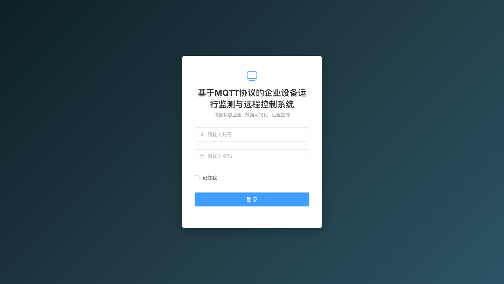
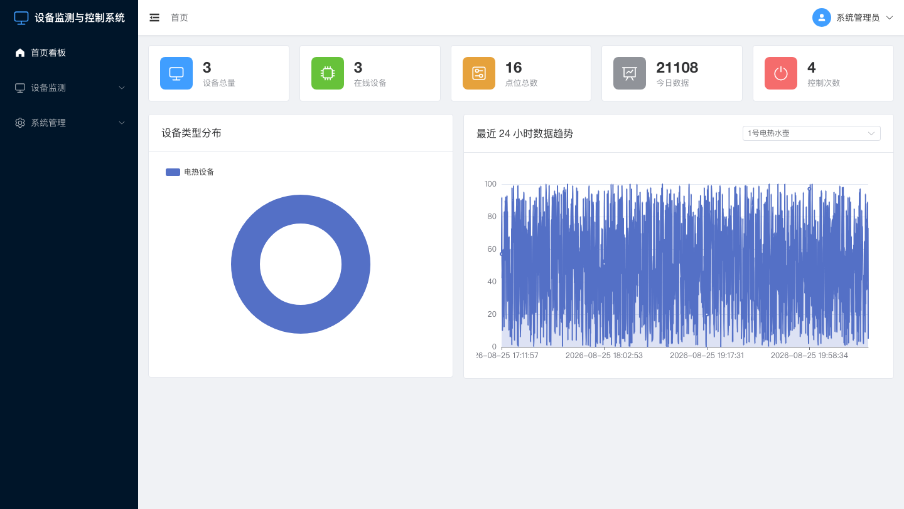
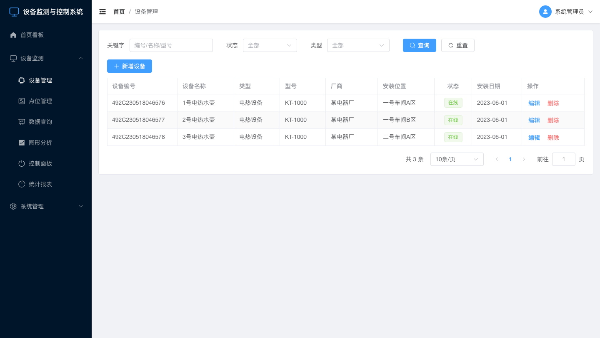
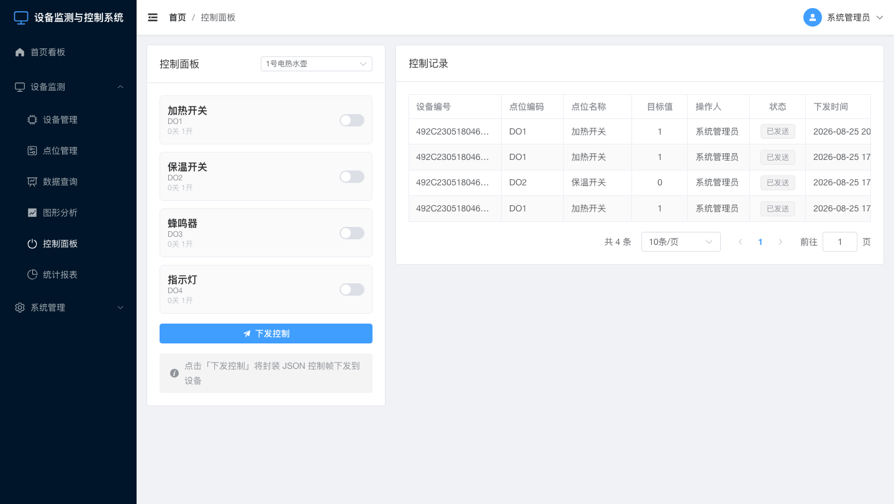
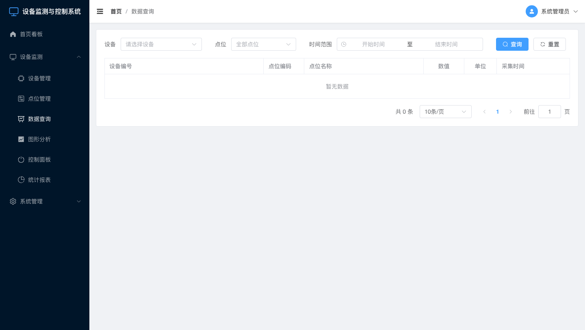
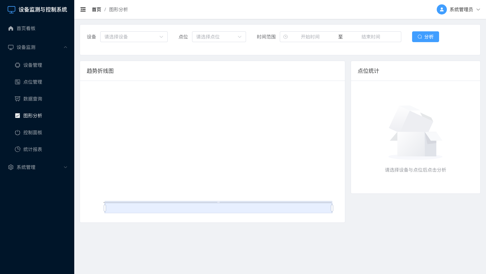

# 基于MQTT协议的企业设备运行监测与远程控制系统

> **Equipment Monitoring & Control System Based on MQTT Protocol** —— 面向企业的设备运行数据采集、远程控制与可视化分析一体化平台。


> 内部技术代号：`emcs`（Equipment Monitoring & Control System）；后端包名 `com.emcs`、Maven `groupId=com.emcs / artifactId=emcs`；前端 npm 包名 `emcs-frontend`。

---

## 📖 项目简介

本系统基于 **B/S（Java Web）** 架构与 **MQTT** 协议，实现多台设备的运行数据**自动采集、解析入库、远程控制、统计与图形分析报表**，并具备完整的 **RBAC 权限管理**。系统自带内嵌 MQTT Broker 与数据模拟器，克隆后即可一键体验完整的「设备上报 → 数据入库 → 可视化 → 远程控制」闭环。

## ✨ 功能特性

- **真实权限管理（RBAC）**：JWT 登录认证 + 用户/角色/菜单权限管理，权限细化到按钮级，前端按权限动态渲染菜单。
- **设备与点位管理**：设备台账、采集点（AI）、控制点（DO）的增删改查，支持量程、单位、缺省值配置。
- **MQTT 数据采集**：订阅 `/kettle/pub`，解析 `aiValueRpt` JSON 数据帧并批量写入数据库。
- **MQTT 远程控制**：封装 `doValueRpt` 控制帧下发到 `/{devId}/sub`，记录控制日志（含操作人与时间）。
- **数据查询与图形分析**：历史数据分页查询、最新值看板、ECharts 趋势折线图。
- **统计报表**：设备/点位/数据汇总卡片、设备类型分布饼图、点位最大/最小/平均统计。
- **开箱即用**：内嵌 Moquette Broker + 数据模拟器，无需外部中间件即可运行演示。

## 🏗 系统架构

```
┌──────────────────────────────────────────┐
│       浏览器（Vue3 + Element Plus + ECharts） │
└────────────────────┬─────────────────────┘
                     │ HTTP / HTTPS（JWT）
┌────────────────────▼─────────────────────┐
│        Spring Boot 后端（Java 21）          │
│   Controller → Service → Repository (JPA) │
│   安全模块（JWT + RBAC）    MQTT 客户端（Paho）│
└──────────┬───────────────────────────┬───┘
           │ JDBC                      │ MQTT
┌──────────▼──────────┐      ┌─────────▼────────┐
│    MySQL 数据库       │      │  MQTT Broker      │
│   （9 张业务表）      │      │  （Moquette 内嵌）  │
└─────────────────────┘      └─────────▲────────┘
                                       │ MQTT 发布/订阅
                              ┌────────┴────────┐
                              │  设备采集器/模拟器  │
                              └─────────────────┘
```

## 🛠 技术栈

| 层 | 技术 |
|----|------|
| 后端 | Spring Boot 3.3、Java 21、Spring Data JPA、Spring Security + JWT |
| 数据库 | MySQL 8/9（utf8mb4） |
| 通讯 | Eclipse Paho MQTT + 内嵌 Moquette Broker |
| 前端 | Vue 3 + Vite + Element Plus + ECharts + Pinia + Vue Router + Axios |

## 📁 目录结构

```
├── backend/          # Spring Boot 后端
│   ├── src/main/java/com/emcs/
│   │   ├── controller/   # REST 接口层
│   │   ├── service/      # 业务逻辑层
│   │   ├── repository/   # 数据访问层（JPA）
│   │   ├── entity/       # 实体类
│   │   ├── security/     # JWT 认证 + RBAC
│   │   ├── mqtt/         # MQTT 客户端 + 内嵌 Broker + 数据处理
│   │   ├── simulator/    # 设备数据模拟器
│   │   ├── config/       # 配置 + 数据初始化
│   │   └── common/       # 统一返回 / 异常处理
│   └── src/main/resources/application.yml
├── frontend/         # Vue 3 前端（构建后由后端静态托管）
├── database/         # 建表与初始化 SQL（参考脚本，应用可自动初始化）
├── docs/             # 需求分析 / 数据库设计 / 系统设计 / API 接口文档
├── report/           # 课程设计报告（LaTeX 源码 + 成品 PDF + 截图）
└── scripts/          # 一键构建 / 运行脚本
```

## 🚀 快速开始

### 环境要求

- JDK 21+、Maven 3.9+、MySQL 8/9、Node.js 18+

### 1. 准备数据库

MySQL 需已启动。应用连接串自带 `createDatabaseIfNotExist=true`，会**自动建库建表**，并在首次启动时自动初始化权限、角色、用户与示例设备。

> 也可手动执行参考脚本：`mysql -uroot < database/schema.sql && mysql -uroot < database/data.sql`

### 2. 构建前端（生成静态资源）

```bash
cd frontend
npm install
npm run build          # 产物输出到 frontend/dist
cd ..
./scripts/build-frontend.sh   # 复制产物到后端静态目录
```

### 3. 启动后端

```bash
cd backend
mvn spring-boot:run
```

启动后默认访问 `http://localhost:8080`，并自动：
- 启动内嵌 MQTT Broker（`tcp://localhost:1883`）；
- 订阅采集主题 `/kettle/pub`；
- 启动数据模拟器，周期上报示例设备运行数据。

### 4. 默认账号

| 账号 | 密码 | 角色 |
|------|------|------|
| admin | 123456 | 超级管理员（全部权限） |
| operator | 123456 | 运维人员（设备/点位/控制/报表，无系统管理） |
| viewer | 123456 | 访客（只读查看） |

## 📡 MQTT 协议

- **采集上报**：主题 `/kettle/pub`，消息类型 `aiValueRpt`

```json
{ "devId":"492C230518046576", "msgType":"aiValueRpt",
  "data":{"AI1":"0","AI2":"4889","AI3":"0","AI4":"20"}, "timestamp":"1688344552" }
```

- **控制下发**：主题 `/{devId}/sub`，消息类型 `doValueRpt`

```json
{ "devId":"492C230518046576", "msgType":"doValueRpt",
  "data":{"DO1":"0","DO2":"0","DO3":"0","DO4":"0"}, "timestamp":"1687333310" }
```

## 🖼 运行截图

| 登录页 | 首页统计看板 |
|--------|--------------|
|  |  |

| 设备管理 | 远程控制面板 |
|----------|--------------|
|  |  |

| 数据查询 | 图形分析 |
|----------|----------|
|  |  |

## ⚙️ 配置说明（application.yml）

| 配置项 | 默认 | 说明 |
|--------|------|------|
| `spring.datasource.url` | jdbc:mysql://localhost:3306/device_monitor | 数据库连接（含自动建库） |
| `spring.datasource.username/password` | root / 空 | 数据库账号密码 |
| `mqtt.broker` | tcp://localhost:1883 | MQTT Broker 地址 |
| `mqtt.embedded.enabled` | true | 是否启动内嵌 Broker（连外部 Broker 时设为 false） |
| `simulator.enabled` | true | 是否启动数据模拟器 |
| `simulator.interval` | 5 | 模拟上报间隔（秒） |
| `jwt.secret` / `jwt.expiration` | — | JWT 密钥与有效期（生产环境请更换密钥） |

## 📚 文档

- `docs/01-需求分析.md` — 需求分析说明书
- `docs/02-数据库设计.md` — 数据库设计说明书（E-R 图 + 9 张表结构）
- `docs/03-系统设计.md` — 系统设计说明书（架构图 + 功能框图 + 业务流程图）
- `docs/04-API接口文档.md` — 后端 API 接口文档
- `report/` — 课程设计报告（LaTeX 源码与成品 PDF）

## 📄 许可证

本项目采用 [MIT License](LICENSE)。
